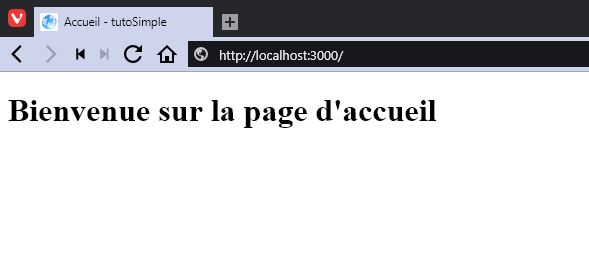
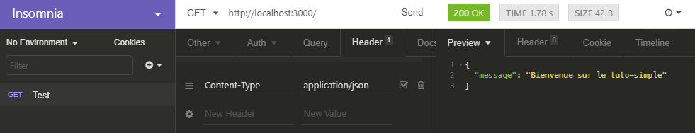

# Première page

Dans ce tutoriel on va simplement faire un module pour comprendre un peu comment ça marche et faire une page simple sans utiliser de données en provenance d'une base de données.

## Préparation

Dans un premier temps on va créer un nouveau projet nommé **tuto-simple** et supprimer les dossiers des modules dans **app/** et les lignes dans le tableau de modules du fichier **bin/app.php** qui sont généré.


Si vous avez des problèmes avec la connexion à la base de données après la suppression des modules, indiquez lui une bdd valide même si elle est vide pour qu'il puisse ce connecter le temps du tuto.



Si vous avez une erreur 404, cela veut dire que les modules ont bien été supprimé et que plus aucune route n'est disponible pour le moment.


## Ajout du module __`Basic`

On va créer une classe **BasicModule** dans un dossier **Basic** qui se trouve dans **app/**. Voici le code de la classe pour le moment :


```php
<?php

namespace App\Basic;

use PHQ\Module;

class BasicModule extends Module
{
}
```


On va y ajouter notre module à la liste des modules à charger dans le fichier **app.php** :


```php
<?php

return [
    /**
     * Liste des modules de l'application
     */
    'modules' => [
        \App\Basic\BasicModule::class
    ],

    // middlewares ...
];
```


Il faut maintenant ajouter des routes à notre modules pour que l'on puisse y effecter des actions et pour répondre à notre url "/" qui pour l'instant renvoie une 404.

Pour ce faire on va ajouter un constructeur et y inclure via l'injection de dépendance le container. Ce dernier permettra d'accéder à différents éléments comme le router. On va y ajouter notre route en même temps qui pointera sur une action.


```php
<?php

namespace App\Basic;

use PHQ\Module;
use PHQ\Routing\Router;
use Psr\Container\ContainerInterface;

class BasicModule extends Module
{
    /**
     * BasicModule constructor.
     * @param ContainerInterface $container
     */
    public function __construct(ContainerInterface $container)
    {
        $this->initRouter($container->get(Router::class));
    }

    /**
     * @param Router $router
     */
    private function initRouter(Router $router): void
    {
        // Pour le moment notre Action n'existe pas
        $router->get('/', IndexAction::class, 'basic.index');
    }
}
```


Je passe par une méthode privée pour l'initialisation des route du module mais vous pouvez faire ce que vous voulez. La chose importante à noté c'est que l'on passe par le container pour le Router \(et pour beaucoup de classe utile\) car cela permet d'avoir une instance unique qui va être partagé par tous les modules.

## Ajout de l'action

Ajoutons notre action dans le dossier **app/Basic/Actions** et n'oublions pas de mettre à jour notre module pour qu'il prenne en compte ce dernier pour la route "/" \(un use de l'action suffira\) :


```php
<?php

namespace App\Basic\Actions;

use Psr\Http\Message\ResponseInterface;
use Psr\Http\Message\ServerRequestInterface;
use Psr\Http\Server\MiddlewareInterface;
use Psr\Http\Server\RequestHandlerInterface;

class IndexAction implements MiddlewareInterface
{

    /**
     * Process an incoming server request and return a response, optionally delegating
     * response creation to a handler.
     * @param ServerRequestInterface $request
     * @param RequestHandlerInterface $handler
     * @return ResponseInterface
     */
    public function process(ServerRequestInterface $request, RequestHandlerInterface $handler): ResponseInterface
    {
        // TODO: Implement process() method.
    }
}
```


On remarque qu'une action c'est comme un middleware \(d'ou l'interface\) sauf que j'ai séparé les concepts pour ne pas se perdre entre les 2 et être plus proche de l'ADR.

## Générer un rendu

Si on actualise la page à ce moment du développement on remarque qu'il y a une erreur car on ne retourne pas d'instance de type **ResponseInterface**. On peut voir aussi au passage que le framework inclus Whoops comme middleware pour détecter les erreurs qui serait lancé au moment du run.

Alors 2 possibilités à ce niveau là. Soit vous êtes sur de renvoyer toujours le même type de vue par rapport à cette action et dans ces cas là le plus simple est de directement retourner la réponse correspondante. Soit vous aller devoir renvoyer plusieurs type de réponse en fonction de la requête et là le mieux est de faire une classe de "rendu" qui va faire le lien entre l'action et les différentes réponse possible.

Pour ce tuto nous allons voir la seconde méthode et donc on va créer un nouveau fichier **IndexRenderer.php** dans le nouveau dossier **Renderers** de notre module. Cette classe étendra de la classe **PHQ\Http\Renderer** :


```php
<?php

namespace App\Basic\Renderers;

use PHQ\Http\Renderer;
use Psr\Http\Message\ResponseInterface;

class IndexRenderer extends Renderer
{
    /**
     * @param $data
     * @return ResponseInterface
     */
    public function normalResponse($data): ResponseInterface
    {
        return $this->renderer->render('@basic/index');
    }
}
```


La classe parente **Renderer** possède 2 méthodes protégé que vous pouvez redéfinir. La méthode **normalResponse** permet de renvoyer une vue html surtout et la méthode **jsonResponse** comme son nom l'indique permet de renvoyer du json.

Si vous afficher la page depuis votre navigateur vous irez dans la méthode **normalResponse** mais si dans la requête il y a un en-tête **Content-Type** avec comme valeur **application/json**, alors c'est la méthode **jsonResponse** qui sera appelé.

Pour vous montrer les différences on va y ajouter la méthode **jsonResponse** comme ci-dessous :


```php
/**
 * @param $data
 * @return ResponseInterface
 */
public function jsonResponse($data): ResponseInterface
{
    return new JsonResponse([
        'message' => 'Bienvenue sur le tuto-simple'
    ]);
}
```


Maintenant il faut ajouter notre vue **index**. Comme vous pouvez le voir il y a un **@basic/** devant. Il s'agit du namespace de la vue. Cela évite les conflit et de mettre les vues toutes dans le même dossier. Mais pour que ça marche il faut indiquer à notre renderer que nous avons un nouveau namespace et dans quel dossier sont les vues.

## Ajout de la vue

Voici la nouvelle version de notre classe **BasicModule** :


```php
<?php

namespace App\Basic;

use App\Basic\Actions\IndexAction;
use PHQ\Module;
use PHQ\Rendering\IRenderer;
use PHQ\Routing\Router;
use Psr\Container\ContainerInterface;

class BasicModule extends Module
{
    /**
     * BasicModule constructor.
     * @param ContainerInterface $container
     */
    public function __construct(ContainerInterface $container)
    {
        $this->initRouter($container->get(Router::class));
        $this->initRender($container->get(IRenderer::class)); // Ajout
    }

    /**
     * @param Router $router
     */
    private function initRouter(Router $router): void
    {
        $router->get('/', IndexAction::class, 'basic.index');
    }

    /** Ajout
     * @param IRenderer $renderer
     */
    private function initRender(IRenderer $renderer): void
    {
        $renderer->addPath('basic', __DIR__ . '/Views');
    }
}
```


Maintenant on peut créer notre fichier **index.twig** dans un dossier **Views** de notre module. Voici un exemple de code html :


```markup
<!DOCTYPE html>
<html lang="fr">
<head>
  <meta charset="UTF-8">
  <meta name="viewport"
        content="width=device-width, user-scalable=no, initial-scale=1.0, maximum-scale=1.0, minimum-scale=1.0">
  <meta http-equiv="X-UA-Compatible" content="ie=edge">
  <meta name="author" content="quenti77">
  <title>Accueil - tutoSimple</title>
</head>
<body>
  <h1>Bienvenue sur la page d'accueil</h1>
</body>
</html>
```


Pour finir, il faut retourner une réponse dans notre action en passant par notre **Renderer**. Pour ce faire on va profiter de l'injection de dépendance pour y construire une action qui attend notre **IndexRenderer**. Et dans la méthode **process** on va retourner la réponse à la méthode **send** de ce renderer :


```php
<?php

namespace App\Basic\Actions;

use App\Basic\Renderers\IndexRenderer;
use Psr\Http\Message\ResponseInterface;
use Psr\Http\Message\ServerRequestInterface;
use Psr\Http\Server\MiddlewareInterface;
use Psr\Http\Server\RequestHandlerInterface;

class IndexAction implements MiddlewareInterface
{

    /**
     * @var IndexRenderer $renderer
     */
    private $renderer;

    /**
     * IndexAction constructor.
     * @param IndexRenderer $renderer
     */
    public function __construct(IndexRenderer $renderer)
    {
        $this->renderer = $renderer;
    }

    /**
     * Process an incoming server request and return a response, optionally delegating
     * response creation to a handler.
     * @param ServerRequestInterface $request
     * @param RequestHandlerInterface $handler
     * @return ResponseInterface
     */
    public function process(ServerRequestInterface $request, RequestHandlerInterface $handler): ResponseInterface
    {
        return $this->renderer->send(null);
    }
}
```


## Test de la route

Vous pouvez réactualiser votre navigateur et admirer la superbe page HTML. Vous pouvez aussi via des outils comme _Postman_ ou _Insomnia_, tester la version json de cette route :











Voilà ! Vous venez de finir votre première page et votre premier module. Les page suivante seront plus rapide à faire vu que les configurations sont déjà faite.

