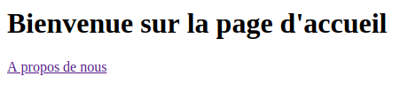

# Formulaire et validation

Dans cette partie, nous allons voir comment intéragir avec plusieurs page via des liens et des formulaires et voir comment valider nos données.

## Partie I : Une nouvelle page

### Préparation

Nous allons partir du code de la partie **Première page** qui contenait déjà un module et une première page d'exemple.

Nous allons créer une page **A propos** pour voir les un peu comment faire des liens entre la page d'accueil et cette page. Nous verrons aussi des urls avec une partie dynamique. Et enfin nous allons créer une page de création de compte utilisateur \(on enregistrera pas les données en base pour le moment\) pour tester les formulaires et leurs validation.

SI tout est bon alors c'est parti !

### Création de la page "A propos"

Qui dit nouvelle page, dit nouvelle route, action et renderer. Donc c'est parti voici les fichiers PHP à faire :


```php
<?php

namespace App\Basic;

use App\Basic\Actions\IndexAction;
use App\Basic\Actions\AboutAction;
use PHQ\Module;
use PHQ\Rendering\IRenderer;
use PHQ\Routing\Router;
use Psr\Container\ContainerInterface;

class BasicModule extends Module
{
    // Constructor ...

    /**
     * @param Router $router
     */
    private function initRouter(Router $router): void
    {
        $router->get('/', IndexAction::class, 'basic.index');
        $router->get('/about', AboutAction::class, 'basic.about');
    }

    // initRender ...
}
```



```php
<?php

namespace App\Basic\Actions;

use App\Basic\Renderers\AboutRenderer;
use Psr\Http\Message\ResponseInterface;
use Psr\Http\Message\ServerRequestInterface;
use Psr\Http\Server\MiddlewareInterface;
use Psr\Http\Server\RequestHandlerInterface;

class AboutAction implements MiddlewareInterface
{

    /**
     * @var AboutRenderer $renderer
     */
    private $renderer;

    /**
     * IndexAction constructor.
     * @param AboutRenderer $renderer
     */
    public function __construct(AboutRenderer $renderer)
    {
        $this->renderer = $renderer;
    }

    /**
     * Process an incoming server request and return a response, optionally delegating
     * response creation to a handler.
     * @param ServerRequestInterface $request
     * @param RequestHandlerInterface $handler
     * @return ResponseInterface
     */
    public function process(ServerRequestInterface $request, RequestHandlerInterface $handler): ResponseInterface
    {
        return $this->renderer->send(null);
    }
}
```



```php
<?php

namespace App\Basic\Renderers;

use PHQ\Http\JsonResponse;
use PHQ\Http\Renderer;
use Psr\Http\Message\ResponseInterface;

class AboutRenderer extends Renderer
{
    /**
     * @param $data
     * @return ResponseInterface
     */
    public function normalResponse($data): ResponseInterface
    {
        return $this->renderer->render('@basic/about');
    }

    /**
     * @param $data
     * @return ResponseInterface
     */
    public function jsonResponse($data): ResponseInterface
    {
        return new JsonResponse([
            'title' => 'A propo',
            'content' => 'lorem ipsum'
        ]);
    }
}
```


Et enfin notre vue twig pour la page :


```markup
<!DOCTYPE html>
<html lang="fr">
<head>
  <meta charset="UTF-8">
  <meta name="viewport"
        content="width=device-width, user-scalable=no, initial-scale=1.0, maximum-scale=1.0, minimum-scale=1.0">
  <meta http-equiv="X-UA-Compatible" content="ie=edge">
  <meta name="author" content="quenti77">
  <title>A propos - tutoSimple</title>
</head>
<body>
  <h1>A propos de <em>tuto-simple</em></h1>
  <div>Lorem ipsum dolor sit amet, consectetur adipisicing elit. Architecto dicta enim exercitationem nemo nihil odit
    porro quasi soluta? Asperiores corporis cum ipsum libero quaerat quasi? At eos nihil similique voluptate.
  </div>
  <div>Alias, assumenda, at beatae consequuntur cupiditate debitis delectus deserunt earum error eum eveniet facere
    fugiat, id non officia omnis optio porro quis quisquam quod reiciendis rem repellat saepe unde vel!
  </div>
</body>
</html>
```


### On relis les pages

Maintenant sur notre vue **index.twig**, on va y ajouter un lien mais au lieu de mettre directement le lien en brute, nous allons demander de nous **le générer** pour nous. Cela permet en cas de changement de ce dernier de ne pas à avoir à changer toutes les URL qui y serait attaché.

Pour cela PHQ à une extension twig instancié et qui ajoute quelques fonctions utile comme la fonction **path\(\)** qui permet à partir du nom et des paramètres, de générer une url.

Voici ce que cela donne en pratique pour les vue index et about de twig :


```markup
<a href="{{ path('basic.about') }}">A propos de nous</a>
```



```markup
<a href="{{ path('basic.index') }}">Revenir à l'accueil</a>
```


Et voilà le résultat :











## Partie II : Valider un formulaire

Nous allons finir par un petit formulaire et un moyen de valider ce dernier.

### Ajout du formulaire

Dans la vue d'index par exemple on va y ajouter le code du formulaire qui sera soumis en POST sur la même URL.


```markup
<hr>
<form action="{{ path('basic.contact') }}" method="post">
  {{ csrf() | raw }}
  <div>
    <label for="email">Votre email :</label><br>
    <input type="email" name="email" id="email" placeholder="votre@adresse.email">
  </div>
  <div>
    <label for="content">Votre email :</label><br>
    <textarea name="content" id="content" placeholder="Le contenu de votre message"></textarea>
  </div>
  <button type="submit">Nous contacer</button>
</form>
```


Ce code est à mettre en dessous du lien **A propos de nous**. On peut remarquer une fonction csrf\(\) qui permet d'ajouter un champs hidden avec comme valeur le token CSRF de la page. On peut y passer le paramètre à false pour ne retourner que la valeur et non tout le champs hidden.

On va y ajouter notre route dans le module :


```php
$router->post('/contact', ContactAction::class, 'basic.contact');
```



N'oubliez pas d'y ajouter le use correspondant quand nous auront créé notre classe.


### Ajout de l'action

Vous connaissez la chanson ^^ , On va ajouter dans le dossier Actions la classe **ContactAction** :


```php
<?php

namespace App\Basic\Actions;

use PHQ\Http\RedirectResponse;
use PHQ\Routing\Router;
use PHQ\Validations\Validator;
use Psr\Http\Message\ResponseInterface;
use Psr\Http\Message\ServerRequestInterface;
use Psr\Http\Server\MiddlewareInterface;
use Psr\Http\Server\RequestHandlerInterface;

class ContactAction implements MiddlewareInterface
{
    /**
     * @var Router $router
     */
    private $router;

    public function __construct(Router $router)
    {
        $this->router = $router;
    }

    /**
     * Process an incoming server request and return a response, optionally delegating
     * response creation to a handler.
     * @param ServerRequestInterface $request
     * @param RequestHandlerInterface $handler
     * @return ResponseInterface
     * @throws \DI\DependencyException
     * @throws \DI\NotFoundException
     * @throws \Exception
     */
    public function process(ServerRequestInterface $request, RequestHandlerInterface $handler): ResponseInterface
    {
        $uriBack = $this->router->generateUri('basic.index');
        $response = new RedirectResponse($uriBack);
        $validator = new Validator([
            'email' => 'required|min:5',
            'content' => 'required|min:5'
        ]);

        if (!$validator->validate($request)) {
            // Error
            errors($validator->getErrors());
            return $response;
        }

        // Success
        flash('success', 'Votre email à bien été envoyer. Nous répondrons dans les plus bref délai.');
        return $response;
    }
}
```


Je pense que ce code mérite une petite explication.

Tout d'abord on génère l'url par rapport au nom de la route \(c'est comme dans la vue twig\). On le stock dans une variable car dans tous les cas on va rediriger vers notre page d'accueil. On créé juste après une réponse de type RedirectResponse\(\) avec notre URL.

Ensuite on créé un **Validator** et on y passe un tableau avec en clef le nom du champ à vérifié et en valeur le ou les type de validations à faire. Dans cette exemple il s'agit des 2 même mais vous pouvez en avoir d'autre comme **max** ou bien encore **confirmed** qui permet de tester qu'un champ et ça version \_confirmed sont bien égaux.

La méthode validate attend soit un tableau des données à vérifier, soit un objet de type **ServerRequestInterface** qui va prendre automatique le **parsedBody\(\)** de la request.

Si on a une erreur on les enregistre en session et sinon on affiche un message flash de succès.

Enfin on retourne notre réponse qui va permettre de rediriger l'utilisateur sur la page d'accueil.

Et voilà c'est aussi simple que ça de vérifier un formulaire. Chose importante : si on avait omis le token CSRF, le middleware CSRFMiddleware n'aurait pas autoriser de continuer.

